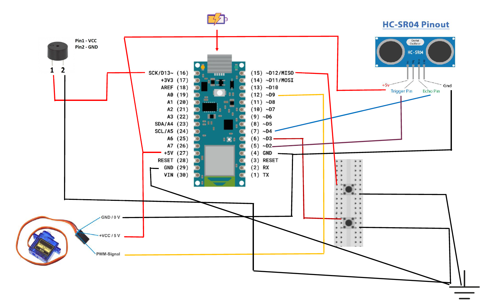
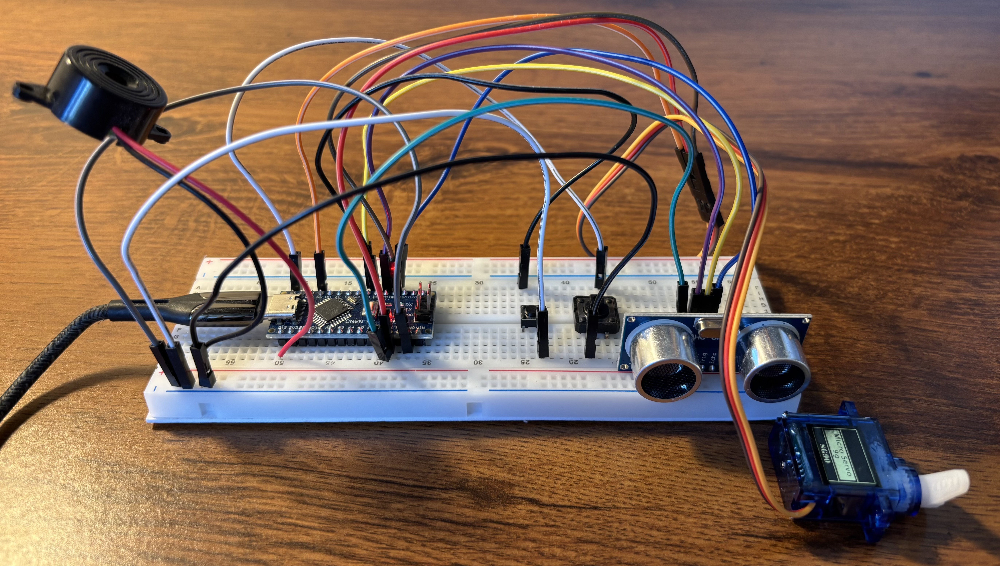

# Panic button with sound alarm project

As safety plays a vital role in our days, it is important to think about such intelligent systems that helps our life and improves protection. Whether we speak about shops, houses or cars protection is crucial for our well-being. 

To develop such smart-systems it's important to have prototypes which serves as a model for the system which is going to be projected. For this purpose I have developed this project. A hardware based blueprint where assembling parts together I have obtained a quite smart prototype of such electrical system, which perhaps could be implemented easily in anyt kind of livings.

This is a simulation, of an automated security system. For simplicity, there are only two buttons to deal with: one activation and deactivation button. When the activation button is pressed, the servo motor will lock the door, and the sensor will be active to detect if any person is coming closer. If there is a person detected a sonar alarm will ring.

But let's dive in more detailed and see how this prototype works:

## Bill of materials

For this implementation, I've had quite less resources to work with:

  - [x] 1 x breadboard
  - [x] 1 x Arduino Nano board
  - [x] 1 x HC-SR04 sensor
  - [x] 1 x SG-90 servo motor
  - [x] 1 buzzer (for the sound)
  - [x] 2 x buttons
  - [x] Jumpers

## Electrical scheme

With the above presented materials, the following electrical scheme was realized on a breadboard:

As the reader can see, the resources are quite a few, but the motivation to realize this project, which in this case is safety, serves an important feature.

## Theory of Operation

### Power

The whole system work under a tension of 5 V. This power comes from the calculator (shown in the above figure) as the prototype projector has to deal with this. For the future, of course, this system could be alimented with an external power source for independent operation. 

This power is distributed via the Arduino Nano board for all the elements: the servo motor, buzzer, sensor and buttons.

### The buttons

There are two buttons on the board: one for the activation of the system, and the other one for deactivation.

When the system is activated, all the work goes automated behind: the servo motor will make a rotation of 180 degrees, to simulate the door blocking and the ultrasonic sensor will be activated to give feedback for the sonar alarm if someone is nearby. 

On the other side when the deactivation button is pressed, the servo motor will open the door and deactivating the sensor and sonar alarm.

### Signals processed

The Arduino Nano board is also able to process the two base signals: either analog or digital.

After powering up, the servo motor is sending PWM signals to one of the processing unit's digital pin (pins D0-D13 can be configured either digital input/output). The buttons can be viewed also as digital inputs for the system: ON or OFF; 1 or 0. For this case the buttons are also connected to the board's digital pinout and handled as inputs in the driver code.

The ultrasonic sensor used has four pins: power (VCC/GND), trigger (input), echo (output). Via the trig line there is short micropulses sended for the senso, which then will emit ultrasonic sound waves. The sensor is keeping the echo pin HIGH until the ultrasonic waves emited by the trigger reaches an object and reflects back to the sensor. When this pin is true, the buzzer will emit the sound.

## The realised protype

The module realised is small, robust system which can be improved and implemented in the future as a security system: 

